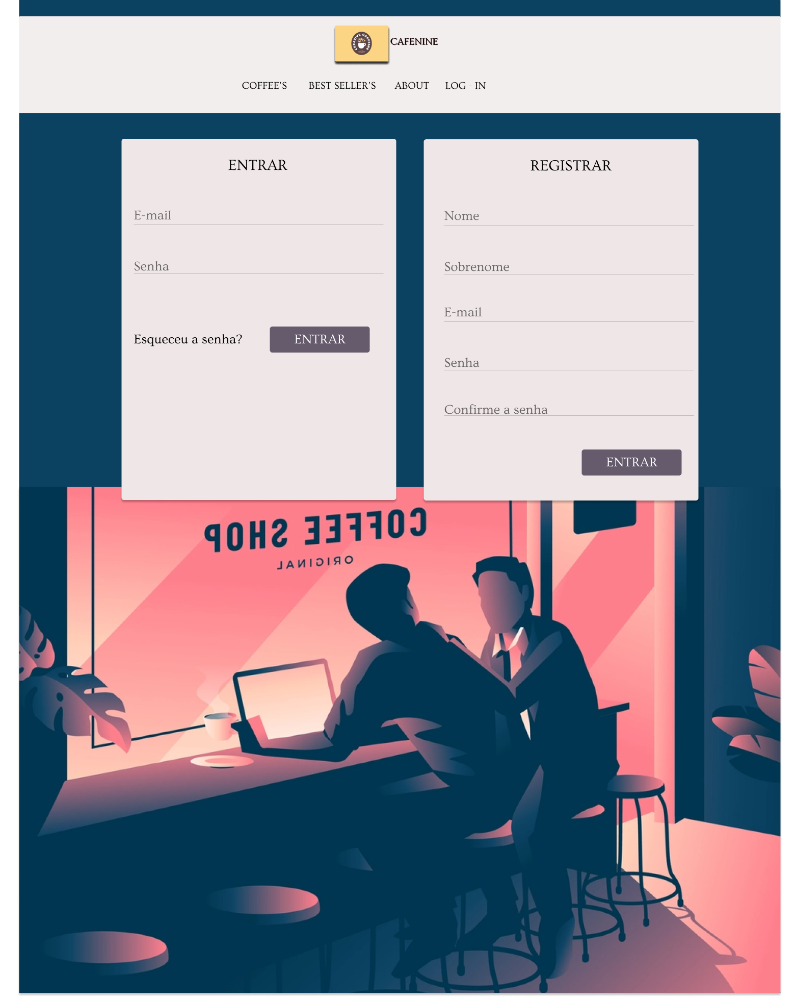
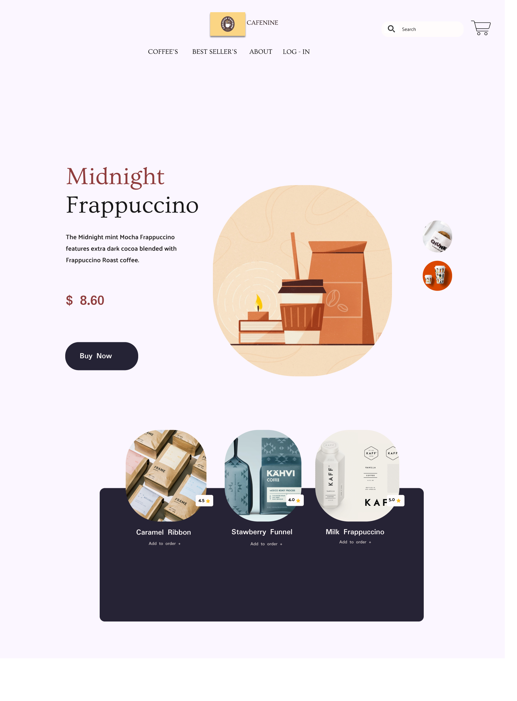
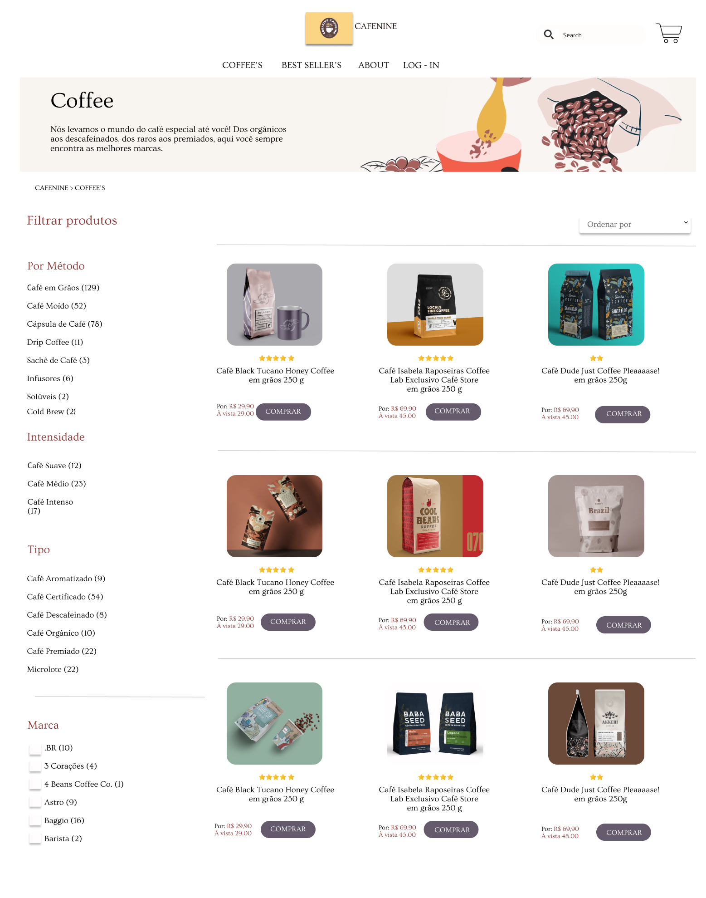
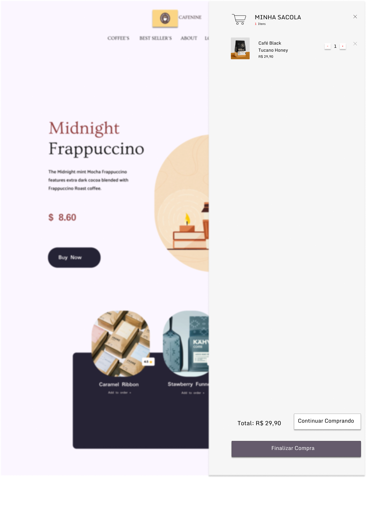
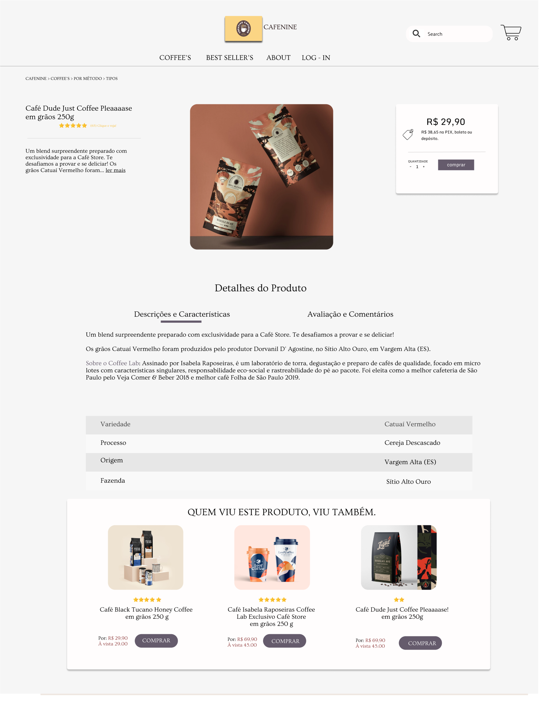
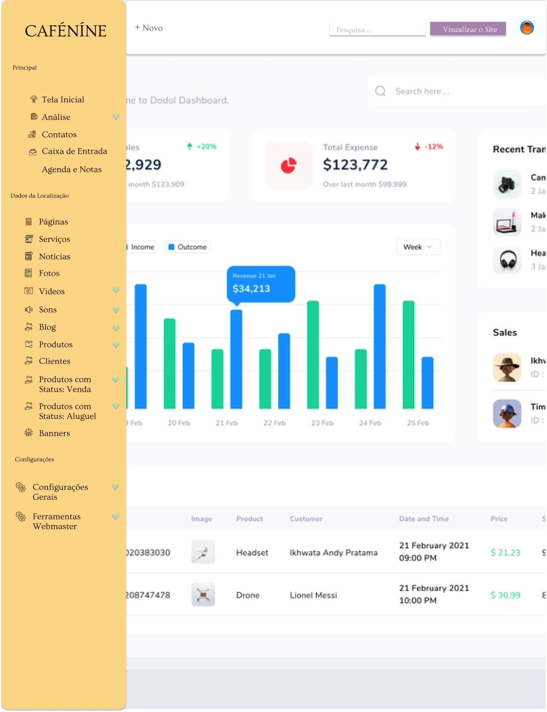
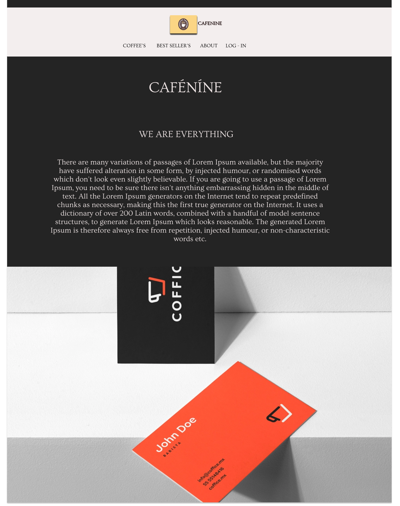

#Vamos começar por aqui!

    Iremos lhe mostrar como ira funcionar o site, onde o mesmo exibirá uma página para cadastro ou login do usuário. 

##Seja muito bem vindo

    Feito login ou cadastro sera exibido nossa página principal com informações e atualizações para deixar nossos usuários sempre informado. 

##Hora de realizar umas comprinhas 

    É nesse momento que o usuário liberará o poder do café, a plataforma exibirá nossa vitrine variada de opções com as mais inúmeras possibilidades. 

##Ainda incerto? 

    Será possivel remover ou adicionar itens em seu pedido de uma forma muito simples e suave.  

##Chega hoje?  

    Vamos finalizar a compra e colocar a água para ferver. Neste momento o usuário finaliza a compra e comemora o gol.  

##Administrador? 

    Este é um dashboard com funções administrativas para que esteja tudo sobre controle.   

##Sobre os desenvolvedores   

    Esta é uma página para que você possa saber tudo sobre nós.  

